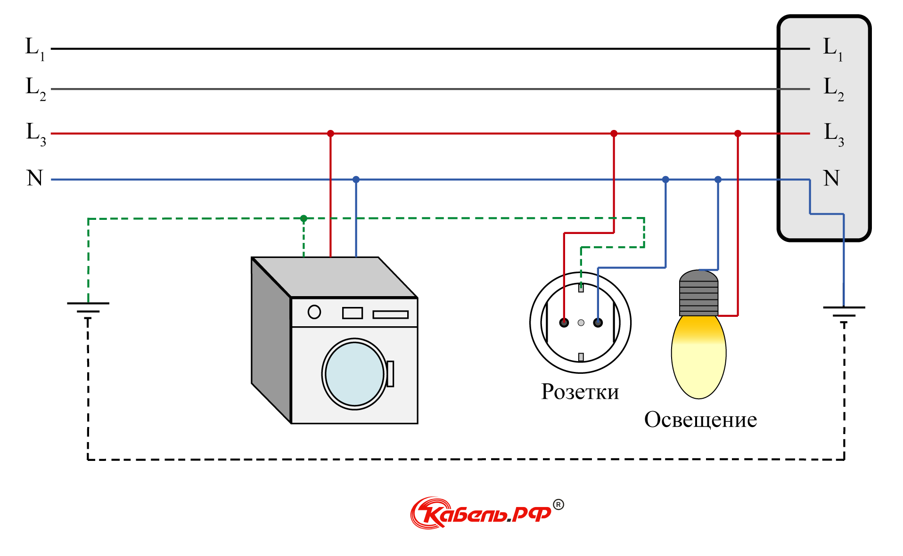
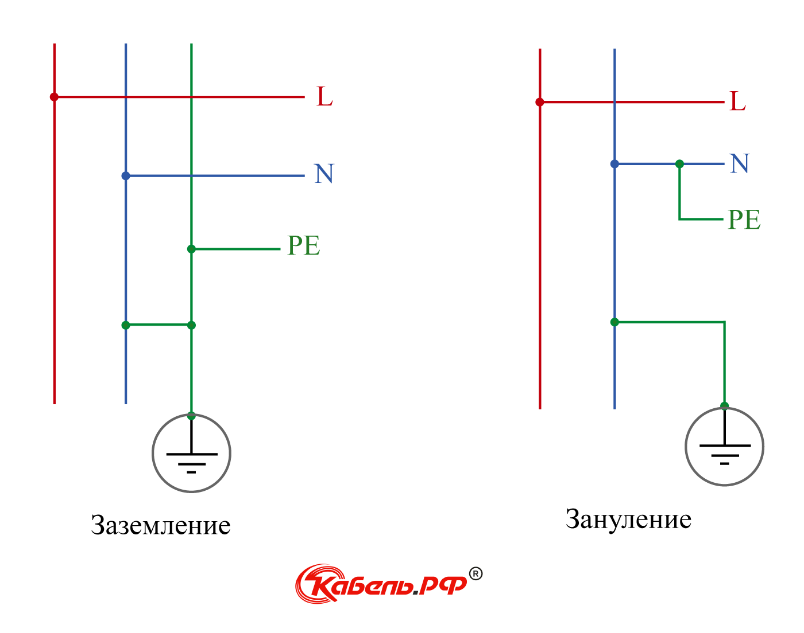

Rules
=

* Каждый раздел, не связанный на прямую с пониманием работы с SoC, переносится на соответствующую ему ветку. 
* Поcле приведения ветки в (около-) завершенный вид, ветка вливается в main через [git rebase main; git push origin main -force](https://git-scm.com/docs/git-rebase)

---

SoC - мозги и сердце IoT
-
[1](https://auroraevernet.ru/articles/soc-sistema-na-kristalle-ustrojstvo-osobennosti-otlichie-ot-cpu/)

SoC (англ. System on a Chip) - в русской аббревиатуре СнК – система на кристалле – это автономный неразборный 
чип (электронная схема), выполняющий определённую функцию. Данная система может принимать и обрабатывать цифровые, 
аналоговые, радиосигналы или работать в аналого-цифровом режиме, объединив на кристалле процессор (или несколько), 
устройство ввода-вывода, блок оперативной и долговременной памяти. 

SoC - это CPU с "обвесами". Помимо вычислительного блока, в котором может быть несколько ядер, SoC включает в себя, в зависимости от наполнения:
 - блок отрисовки графики;
 - протоколы (интерфейсы) для связи с внешними устройствами;
 - оперативную и постоянную память;
 - модема для подключения к беспроводным системам;
 - аналого-цифровые преобразователи;
 - цифро-аналоговые преобразователи;
 - таймеры, счётчики;
 - источников опорной частоты;
 - регуляторов напряжения;
 - системные контролёры:
   - северный мост (внутреннее взаимодействие);
   - южный мост (внешнее взаимодействие);

---

ESP - аналог Arduino, Raspberry Pico
-
[<u>params by docs</u>](https://docs.espressif.com/projects/esp-idf/en/release-v5.0/esp32/hw-reference/chip-series-comparison.html)
&nbsp;

Для начала определим, о чем именно говорится в datasheet:

|                     Param                      |                                 Description                                  |
|:----------------------------------------------:|:----------------------------------------------------------------------------:|
|                      Core                      |                             Вычислительный блок                              |
|          Wi-Fi protocols, Bluetooth®           |                Модемы для подключения к беспроводным системам                |
|               Typical frequency                |    Стандартная частота работы (влияет на производительность и потребление    |
|                      SRAM                      |                 Оперативная память (энергозависимая) \[ОЗУ\]                 |
|                      ROM                       |       Постоянная память (энергонезависимая, для загрузки BIOS) \[ПЗУ\]       |
|                 Embedded flash                 |       Флеш-память (EEPROM) \[ максимальный объем флешки в виде чипа \]       |
|                 External flash                 |              Возможность увеличения объема ОЗУ внешними чипами               |
|                     Cache                      |                                 Кеширование                                  |
|                      ADC                       |                    Аналого-цифровые преобразователи (АЦП)                    |
|                      DAC                       |                    Цифро-аналоговые преобразователи (ЦАП)                    |
|                     Timers                     |                                   Таймеры                                    |
|               Temperature sensor               |                        Наличие температурного сенсора                        |
|                  Touch sensor                  |                             Датчик прикосновения                             |
|                  Hall sensor                   |                     Наличие датчика Холла (магнитометр)                      |
|      GPIO (General-purpose input/output)       |       Пины, которые можно запрограммировать на ввод и вывод информации       |
|                      SPI                       |                Количество настраиваемых линий интерфейса SPI                 |
|                 LCD interface                  |                       Возможность вывода на LCD экраны                       |
|                      UART                      |                Количество настраиваемых линий интерфейса UART                |
|                      I2C                       |                Количество настраиваемых линий интерфейса I2C                 |
|                      I2S                       |                Количество настраиваемых линий интерфейса I2S                 |
|                Camera interface                |                         Возможность работы с камерой                         |
|           DMA (Direct memory access)           | Возможность обмена данными между SoC и памятью без участия  CPU компа (???)  |
|              RMT (Remote Control)              |    Возможность применения инфракрасных сигналов дистанционного управления    |
|                 Pulse counter                  |               Возможность подсчета изменения значения сигнала                |
|                    LED PWM                     |                   Возможность ШИМ модуляции для освещения                    |
|                     MCPWM                      |                              Какой-то ШИМ (???)                              |
|                    USB OTG                     |         Возможность работать как USB устройство (мышь, клава, проч)          |
| TWAI® controller (compatible with ISO 11898-1) | Возможность применения протокола для автомобильных и промышленных приложений |
|          SD/SDIO/MMC host controller           |                   Возможность работать с картами памяти SD                   |
|             SDIO slave controller              |          Возможность работать с расширенной формой SD-карты (SDIO)           |
|                  Ethernet MAC                  |                Возможность работать с MAC-адресами (интернет)                |
|                      ULP                       |      Наличие сопроцессора для работы с датчиками в режиме глубокого сна      |
|                  Secure boot                   |                        Защита от взломов при запуске                         |
|                Flash encryption                |                           Криптография флеш памяти                           |
|                      OTP                       |                       Размер одноразового пароля (???)                       |
|                      AES                       |                        Поддержка стандарта шифрования                        |
|                      HASH                      |                            Поддержка хеширования                             |
|                      RSA                       |                    Поддержка криптографического ключа RSA                    |
|        RNG (Random Number Generation )         |             Возможность генерации действительно случайных чисел              |
|                      HMAC                      |              Возможность аутентификации при помощи хеш функции               |
|               Digital signature                |                 Возможность подписи сообщений при помощи RSA                 |
|                      XTS                       |                        Возможность шифрования файлов                         |
|   Deep-sleep (ULP sensor-monitored pattern)    |                    Токопотребление в режиме глубокого сна                    |

---
Плата разработчика (отладочная плата) (devkit)
-
Вычислительный блок (микросхема) с "обвесами" устанавливается на миниатюрную печатную плату => получается SoC (модуль).
Модуль (SoC) паяется к печатной плате, позволяющей использовать возможности SoC => Готовый devkit (печатная плата с выводами и SoC).

[Состав платы разработчика ESP32](https://docs.espressif.com/projects/esp-idf/en/v5.1.1/esp32/hw-reference/esp32/get-started-devkitc.html):
- SoC (с распаянной PCB-антенной WiFi/Bluetooth или без);
- Программатор (CP21XX, CH34XX) - микросхема для записи инструкций в память вычислительного блока;
- Индикаторы питания, отладочные светодиоды;
- Регулятор напряжения - для питания от USB и пина питания 5V (LDO DC-DC 5V to 3.3V);
- Кнопки сброса (Reset) и кнопка режима загрузки прошивки (Boot);
- [Порт `USB Micro-B` или `USB Type-С`;](https://webznam.ru/blog/porty_usb_razlichnykh_tipov/2022-10-29-2174)
- Выводы (пины) для подключения периферии, датчиков.

---

Номенклатура Esp32 modules
-

[ESP32] [CORE] [FLASH] [CONNECTION] [PSRAM] [TEMPERATURE] [Package] [revision]

**[`Core`]** = [`D/U`] - dual core; [`S`] - single core

**[In-package `flash`]** = [`0`] - no in-package flash; [`2`] - 2 MB flash; [`4`] - 4 MB flash

**[`Connection`]** = [`WD`] - Wi-Fi b/g/n + Bluetooth/Bluetooth LE dual mode

**[In-package `PSRAM`]** = [`R2`] - 2 MB PSRAM

**[High `temperature`]** = [`H`]

**[`Package`]** = [`Q6`] - QFN 6 * 6; [`N/A`] - QFN 5 * 5

**[Chip `revision`]** = [`V3.0 or newer`]

---
[Товарный ряд ESP modules<a href="#sell" id="sellRef">1</a><a href="#how" id="howRef"> <u>0</u></a>](https://www.espressif.com/en/products/socs)
-

[<u>[Info ESP32 Series]</u>](https://kotyara12.ru/iot/esp32_chips/)
&nbsp;
[<u>[ESP32 Modules]</u>](https://www.espressif.com/en/products/modules)
&nbsp;
[<u>[Help select]</u>](https://products.espressif.com/#/product-selector?language=en)

 

| EPS32 SoC Series |                                                                                                  Datasheet                                                                                                   |                                  Current Consumption <a href="#noteDS" id="noteDSRef">2</a>                                  | RISC-V |                Core                 | Frequency, MHz | SRAM, KB | ROM, KB |  WiFi   |    Bluetooth     |       Zigbee       |                           Additional                           |
|:--------------------:|:------------------------------------------------------------------------------------------------------------------------------------------------------------------------------------------------------------:|:---------------------------------------------------------------------------------------------------------------------------------------:|:------:|:-----------------------------------:|:--------------:|:--------:|:-------:|:-------:|:----------------:|:------------------:|:--------------------------------------------------------------:|
|        EPS32         |                                                     [тык `Series`](https://www.espressif.com/sites/default/files/documentation/esp32_datasheet_en.pdf")                                                      |                                    [Series: page 29](./datasheets/esp32_datasheet_en.pdf "page 29")                                     | False  | Xtensa® 32-bit LX6 dual/single core |   up to 240    |   520    |   448   | 2.4 GHz |  Bluetooth v4.2  |       False        |                      Много разных модулей                      |
|          S3          |                                                      [тык `S3`](https://www.espressif.com/sites/default/files/documentation/esp32-s3_datasheet_en.pdf)                                                       |                                     [S3: page 59](./datasheets/esp32-s3_datasheet_en.pdf "page 59")                                     | False  |    Xtensa® 32-bit LX7 Dual-core     |   up to 240    |   512    |   384   | 2.4 GHz | Bluetooth 5 (LE) |       False        | Vector instructions,  connection to flash and external RAM |
|          S2          |                                                      [тык `S2`](https://www.espressif.com/sites/default/files/documentation/esp32-s2_datasheet_en.pdf)                                                       |                                     [S2: page 39](./datasheets/esp32-s2_datasheet_en.pdf "page 39")                                     | False  |   Xtensa® 32-bit LX7 Single-Core    |   up to 240    |   320    |   128   | 2.4 GHz |      False       |       False        |                  Ultra-low-power performance                   |
|          C6          |                                                      [тык `C6`](https://www.espressif.com/sites/default/files/documentation/esp32-c6_datasheet_en.pdf)                                                       |                                     [C6: page 57](./datasheets/esp32-c6_datasheet_en.pdf "page 57")                                     |  True  |  32-bit single-core microprocessor  |   up to 160    |   512    |   320   | 2.4 GHz | Bluetooth 5 (LE) |        True        |                   Works with external flash                    |
|    C3 (+ ESP8685)    | [тык `C3`](https://www.espressif.com/sites/default/files/documentation/esp32-c3_datasheet_en.pdf)  [тык `ESP8685`](https://www.espressif.com/sites/default/files/documentation/esp8685_datasheet_en.pdf) | [C3: page 47](./datasheets/esp32-c3_datasheet_en.pdf "page 47") [ESP8685: page 40](./datasheets/esp8685_datasheet_en.pdf "page 40") |  True  |  32-bit single-core microprocessor  |   up to 160    |   400    |   384   | 2.4 GHz | Bluetooth 5 (LE) |       False        |                   Allow connection to flash                    |
|   C2 (aka ESP8684)   |                                                    [тык `ESP8684`](https://www.espressif.com/sites/default/files/documentation/esp8684_datasheet_en.pdf)                                                     |                                     [C2: page 27](./datasheets/esp8684_datasheet_en.pdf "page 27")                                      |  True  |  32-bit single-core microprocessor  |   up to 120    |   272    |   576   | 2.4 GHz | Bluetooth 5 (LE) |       False        |                      16 KB for cache SRAM                      |
|          H2          |                                                      [тык `H2`](https://www.espressif.com/sites/default/files/documentation/esp32-h2_datasheet_en.pdf)                                                       |                                     [H2: page 33](./datasheets/esp32-h2_datasheet_en.pdf "page 33")                                     |  True  |  32-bit single-core microprocessor  |    up to 96    |   320    |   128   |  False  | Bluetooth 5 (LE) | True +  Thread |                         4 KB LP Memory                         |

<a id="how" href="#howRef"><u>0</u></a> [Helped by Benjamin Loison](https://translated.turbopages.org/proxy_u/en-ru.ru.78954326-66106b9c-92c2ed9b-74722d776562/https/stackoverflow.com/questions/25579868/how-to-add-footnotes-to-github-flavoured-markdown?__ya_mt_enable_static_translations=1)

<a id="sell" href="#sellRef">1</a> Basic ESP32 (ESP32-WROOM) + QSPI PSRAM (additional code required) = ESP32-WROVER (pumped-up ESP32-WROOM)

<a id="noteDS" href="#noteDSRef">2</a> Datasheet`ы взяты с инета, для подстраховки загружены PDF файлы с указанием страницы

---
RISC-V 
-

[1](http://digitrode.ru/computing-devices/mcu_cpu/3414-chto-iz-sebya-predstavlyaet-arhitektura-risc-v-i-pochemu-ona-mozhet-byt-zamenoy-arm.html)
&nbsp;
[2](https://www.osp.ru/os/2020/02/13055471)
&nbsp;
[3](https://tproger.ru/articles/processors-architectures-review)

<u>_Архитектура (микро-)процессора</u>_ - или набор команд для работы над битами или подходы к физической реализации данного набора (как именно гоняют электроны в ячейках памяти (регистрах)).

RISC-V - команды проще, короче, быстрее в выполнении, но их относительно мало и они не оптимизированы под конкретные задачи, особенности физической реализации.

---
Важные параметры для выбора SoC
-

---

Light ON<a href="#led" id="ledRef">1</a>
=

Светодиодная (адресная) лента (aka NeoPixel)
-

<a id="gyver" href="https://alexgyver.ru/ws2812_guide/"><u>AlexGyver</u></a>
&nbsp;
[1](https://habr.com/ru/companies/samsung/articles/696508/)
&nbsp;
[2](https://роботехника18.рф/ws2812b-ардуино//)

Сущность: RGB-светодиод, цвет которого можно назначать программно  
(с помощью микросхемы, которая определяет протокол взаимодействия с ним). Образно, это единичный пиксель из экрана монитора.

 

Params:
- Black PCB / White PCB — цвет подложки ленты, чёрная / белая
- 1m/5m — длина ленты в метрах
- 30/60/74/96/100/144 — количество светодиодов на 1 метр ленты
- IPXX – влагозащита
  - IP30 лента без влагозащиты
  - IP65 лента покрыта силиконом
  - IP67 лента полностью в силиконовом коробе
- ECO – “экономная” версия ленты, менее качественная и яркая чем обычная <a id="istok" href="#gyver">AlexGyver</a>

|  Чип   | Напряжение | Чип рулит N диод(-ами)<a href="#diod" id="diodRef">1</a> | Количество пинов | Потребление тока диодом (max),mA |                                           Datasheet                                           | Размер данных   на диод |
|:------:|:----------:|:-------------------------------------------------------------------:|:----------------:|:------------------------------------:|:---------------------------------------------------------------------------------------------:|:---------------------------:|
| WS2811 |   12-24V   |                                  3                                  |        8         |                  36                  |      [тык](https://www.promelec.ru/fs/sources/e0/8f/cc/d5/f981f4b46c6d47331add022d.pdf)       |             24              |
| WS2812 |  3.5-5.3V  |                                  1                                  |        4         |                  36                  |      [тык](https://www.promelec.ru/fs/sources/3c/92/4c/24/0c87281f8c01c76cb3d650ec.pdf)       |             24              |
| WS2813 |  3.5-5.3V  |                                  1                                  |        6         |                  36                  | [тык](https://sunliteleds.com/wp-content/uploads/2023/07/WS2813-IC-Datasheet-SuntechLite.pdf) |             24              |
| WS2815 |  9-13.5V   |                                  1                                  |        6         |                  36                  |      [тык](https://www.promelec.ru/fs/sources/68/4c/1a/a9/4ba343a000934b970d976e79.pdf)       |             24              |
| WS2818 |   12/24V   |                                  3                                  |        8         |                  36                  |        [тык](https://www.tme.eu/Document/22185e725bbf20b943bde01e7736a97b/WS2818.pdf)         |             24              |

<a href="#ledRef" id="led">0</a> LED (Light Emitting Diode)

<a href="#diodRef" id="diod">1</a> В этом разделе `диод`== `адресный RGB-светодиод`

Power Management
-

[1](https://apeyronled.ru/articles/kak-podklyuchit-lentu-12v-24v-k-bp/)
&nbsp;
[2](https://blog.fenix.help/zalipatelnaya-nauka/opredeleniye-fazy-i-nolya-v-elektrotekhnike)
&nbsp;
[3](https://cable.ru/articles/2090-opasno--kak-ne-nado-delat-zazemlenie)

**Фаза, ноль и земля**

От трансформаторной подстанции на подъездный электрощит многоквартирного дома поступает три фазы, напряжение между парами которых равно 220 В. 
Также к земле трансформаторной подстанции подключён (условный) нуль(N). Нуль передает ток обратно в трансформатор 
(закольцовывает движение электрической энергии) и не всегда равен 0 В (для этого нужно, чтобы напряжение на всех линиях фазы было равно
(из-за схемы получения трех фаз в трансформаторе)). Напряжение фаз относительно нуля тоже равно 220 В.
Для создания действительного нуля (провода с нулевым потенциалом) применяется так называемое защитное заземление (земля), которое обозначается PE.
Обычно, эта линия подключается к зданию, потому что трансформаторы расчитаны на 4 линии (3 фазы и нуль).

<kbd>

</kbd>

Проводник PE гальванически соединён с N, при прозвонке тестером обнаружится, что присутствует электрический контакт (протекает ток).
Сочетание фазы и N нужно, чтобы была возможность обнаружить пробой (накопление потенциала на корпусе оборудования), который может привести к 
поражению человека, прикоснувшегося к оборудованию, и поломке оборудования. В случае пробоя срабатывает УЗО (управляющее защитное устройство), которое отводит
напряжение на землю. Потребители сети нельзя подключать к земле, потому что тогда случится пробой.

---

